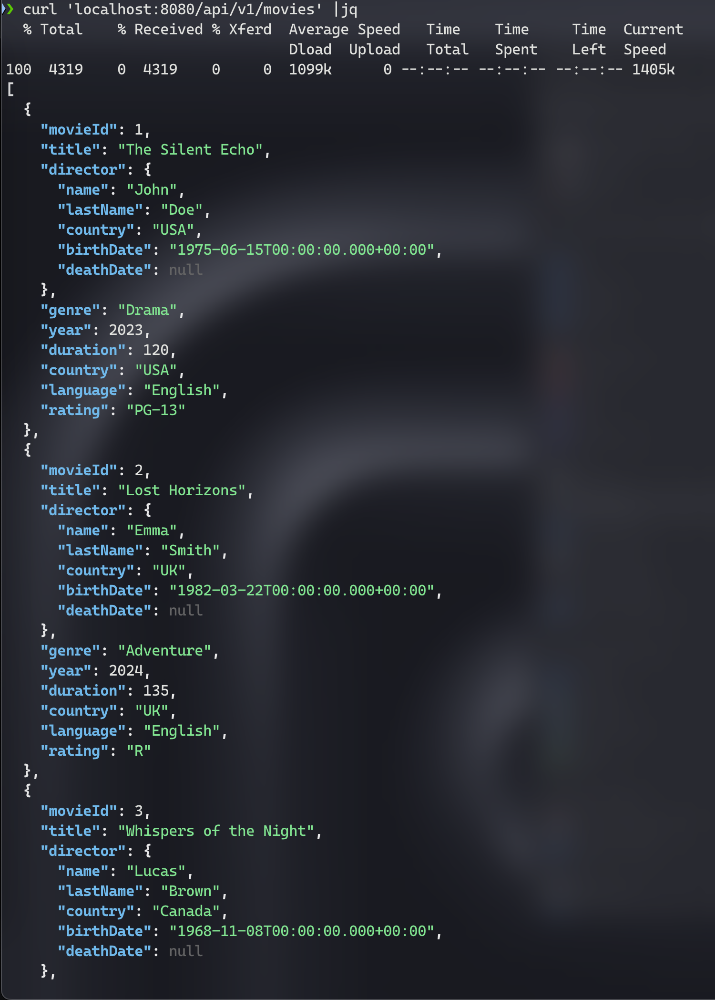
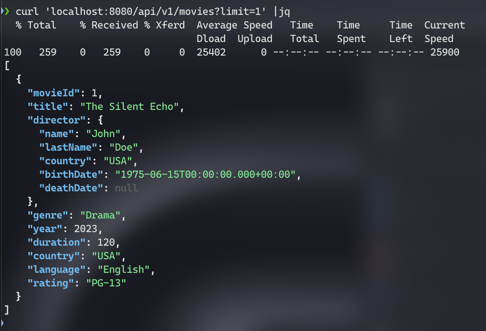
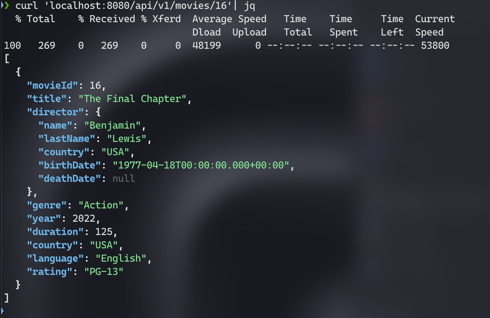
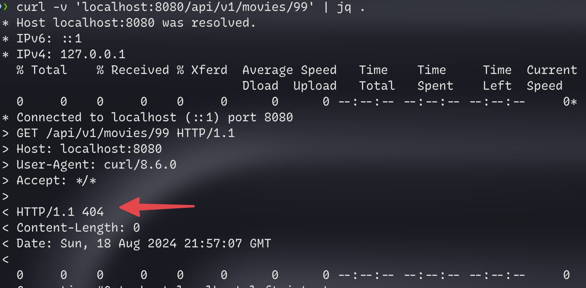

# Movies MS, con Spring Boot

Proyecto de Asignatura

```
Desarrollo Full Stack I
Ingeniería en Desarrollo de Software
Duoc UC

Profesor: Carlos Valverde
Estudiante: Sebastián Kravetz

```

### Stack

- Spring Boot v3
- Spring Boot Web Starter
- Lombok
- JDK 22

---

### Endpoints:

> Base Host: [DIRECCION_IP]:8080/api/v1

#### I. Obtener todas las películas

Retorna el listado completo de películas ó filtra por un límite de resultados

`[GET] /api/v1/movies`

- Query Params:
    - _opcional_ limit: int
        - ej: `/api/v1/movies?limit=5`

- Ejemplo Response `curl /api/v1/movies`:
    - 
- Ejemplo Response `curl /api/v1/movies?limit=1`:
    - 

#### II. Obtener película por ID

`[GET] /api/v1/movies/{id}`

Retorna el primer resultado que coincide con el id solicitado

- Ejemplo Response `curl api/v1/movies/16`
    - Si el movie id es encontrado, retorna código HTTP 200
    - 
- Response response movie id no encontrada
    - Devolverá correctamente código HTTP 404
    - 

### Mantenedor

Sebastián Kravetz (@rrooddooxx)
